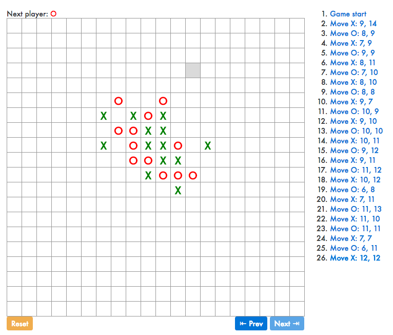

# React Gomoku

Enchanced version of the [official React tutorial](https://facebook.github.io/react/tutorial/tutorial.html).

Enhancements:
- Display move locations
- Bold the currently-selected item in the move list
- Rewritten Board to use two loops to make the squares instead of hardcoding them
- Reset button with confirmation
- Can go backward and forward in history
- Show current Move with Bold
- Colored signs
- 20x20 board
- Highlights winning squares on a 3x3 board (when `SIZE=3` in `board.js`)

It looks like this:

